# High-Level-Design

<!-- TABLE OF CONTENTS -->
<details>
  <summary>Table of Contents</summary>
  <ol>
    <li>
      <a href="#about-high-level-design">About High Level Design</a>
      <ul>
        <li><a href="#built-with">Built With</a></li>
      </ul>
    </li>
    <li>
      <a href="#getting-started">Getting Started</a>
      <ul>
        <li><a href="#prerequisites">Prerequisites</a></li>
        <li><a href="#installation">Installation</a></li>
      </ul>
    </li>
    <li><a href="#usage">Usage</a></li>
  </ol>
</details>

# High Level Design Baisc 
we have to keep in mind of all these basic when we are designing any system 
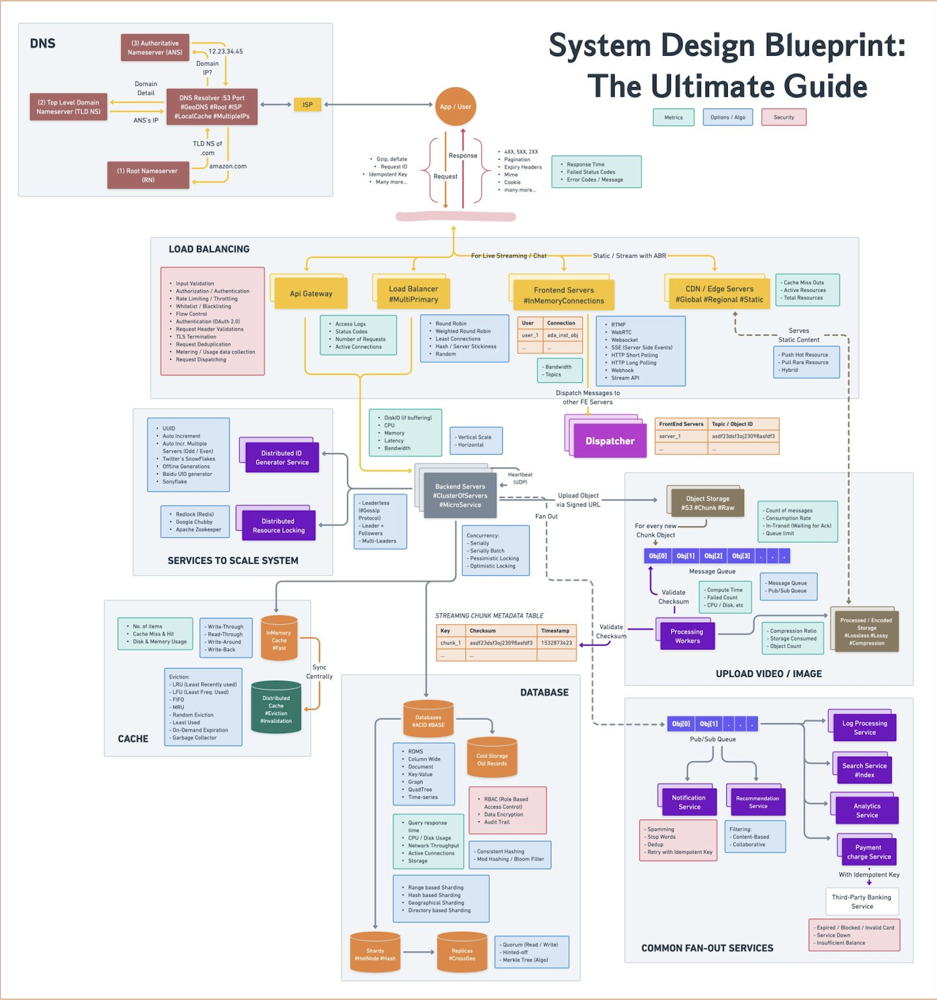

## DNS (Domain Name Server)
    ISP-internate service provider
    DNS Resolver
     #:53 port
     #GeoDNS
     #ISP
     #Local Cache 
     #MultiplesIP
     1. Root Name Server(RN)
     2. Top Level Domain Server (TLD NS)(take Doamin Detail and return ANS'IP)
     3. Authoritative Nameserver (ANS) (take Domain IP? and return 12.23.34.45)

     Low Letancy application :
     Caching is required 
     we can cache on::
     * BroLser Level
     * OS level
     * ISP Level
     * DNS Server
     
     User in india and DNS is in USA then resolving the DNS domain take 900ms mean we have 900ms lag in request so avoid the lag we have disributes DNS in all the Geographically Location


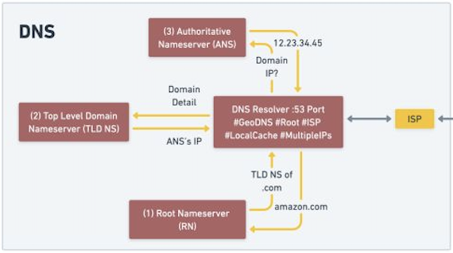

## Load Balancing

### 1. Load Balancer
  ####  Stateful Loadbalancing
   * All the request with same ID must be routed to same server
   *  Load should be uniformly distributed.
   We can add and remove the machine and evenly distributed the load using mod
  
  ```
  N-Number of server
  ID%N=server_id
  N=3
  11%3=2
  21%3=0
  10%3=1
  repectively route toward server
  ```
   


### 2. API Gateway

### 3. CDN (Static content)

 Global external Application Load Balancer or the classic Application Load Balancer 

 Cloud CDN works with the global external Application Load Balancer or the classic Application Load Balancer to deliver content to your users. The external Application Load Balancer provides the frontend IP addresses and ports that receive requests and the backends that respond to the requests.
 * Cloud CDN
  [follow this docs](https://cloud.google.com/cdn/docs/overview#:~:text=Cloud%20CDN%20works%20with%20the,that%20respond%20to%20the%20requests.)


  ## How will store large size files??
   around 50TB
   
   1. Store the file
   2. System should be Reliable (it should not lost)
   3. Download the file
   4. Analyties

   Divide the 50TB file in chunck (c1,c2,c3,c4,c5)
   divide the file chunck of 1MB
   ```
   No of chunks = 50TB/1MB = 50*1MB*10^6/1MB 
   = 50*10^6 chunks
 what is issue to recieve too many part of chunks??

 Issues:
 1. Collating the chunck(concates the chunck there is overhead)
 2. Cost of entires
   ```

  ### HDFS Hadoop Distributed File System

  default size of HDFS to divide into chunks is
  ```
  HDFS 2.0  128MB
  HDFS 1.0  64MB

  table is maintaing in  Name Node Server(Only one NNS in whole HDFS cluster that is replicated)
  Name Node Server -->this is source of truth
  file1:chunk1->meta-data-1
  file2:chunk2->meta-data-2

  Why 128MB chunk??
  These system is design for certain type of operation
   store large file
   download large file
   some analytices
   These do cerntain type of benchmarking of each chunk
   File size is increase peoples are using large file so they revise the default size 128MB for comman operation

   if size of chunk is too big, retries will be expensive since they discard partial output?

   There is DATA NODES it have original data like
   data node1   data note2     data node3
   chunk1        chunk2         chunk3
   chunk3        chunk1         chunk2      replication

   replicate data synchronusly from Name Server Node to DATA NODE parallely
   If every file is written into DATA NODES then return SUCCESS
   This is follow MASTER SLAVE ARCHITECTURE
  ```
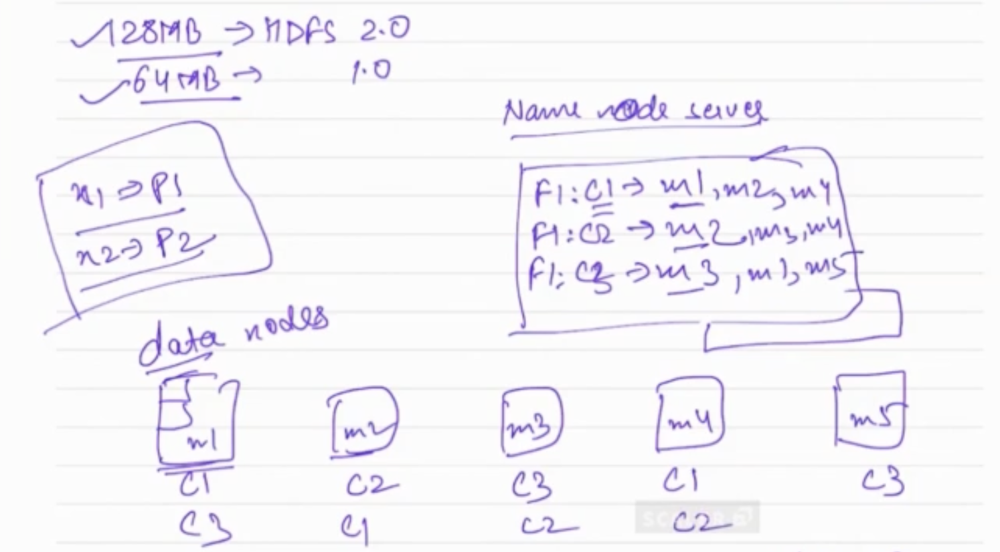

### Rack Awareness
Most of us are familiar with the term Rack. The rack is a physical collection of nodes in our Hadoop cluster (maybe 30 to 40). A large Hadoop cluster is consists of many Racks. With the help of this Racks information, Namenode chooses the closest Datanode to achieve maximum performance while performing the read/write information which reduces the Network Traffic. A rack can have multiple data nodes storing the file blocks and their replica’s. The Hadoop itself is so smart that it will automatically write a particular file block in 2 different Data nodes in Rack. If you want to store that block of data into more than 2 Racks then you can do that. Also as this feature is configurable means you can change it Manually. Example of Rack in a cluster

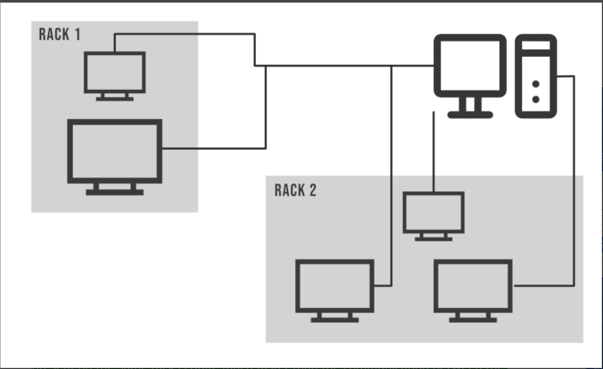
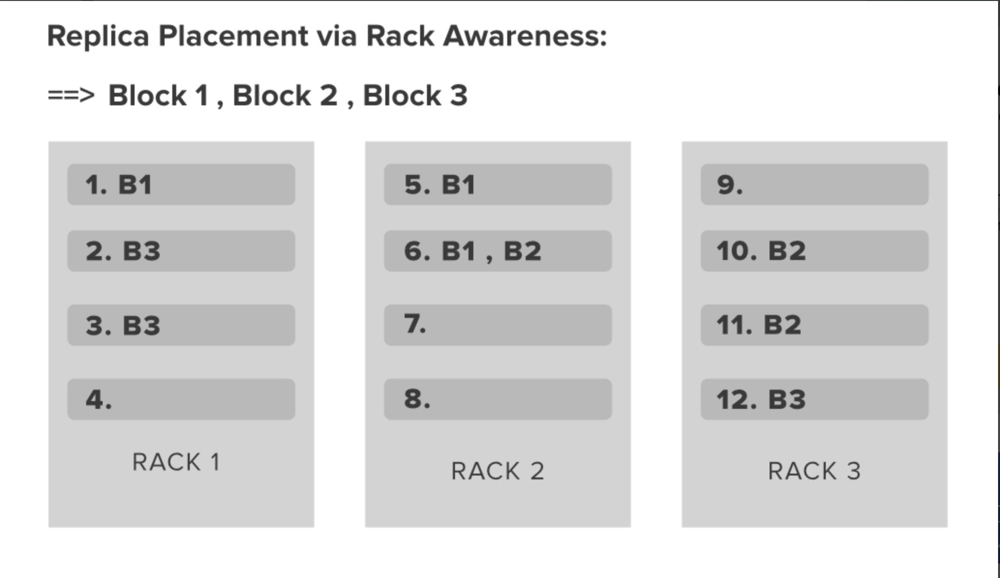

#### Rack awareness policies

* There should not be more than 1 replica on the same Datanode.
* More than 2 replica’s of a single block is not allowed on the same Rack.
* The number of racks used inside a Hadoop cluster must be smaller than the number of replicas.
   
  More Details :
 [Rack Awareness](https://www.geeksforgeeks.org/hadoop-rack-and-rack-awareness/)

 #### Who does the devision part??
 Clent is sending stream of data in byte if reached to 128MB that is send to Name Node Server it is make chunk of it and store to into Data Node server

 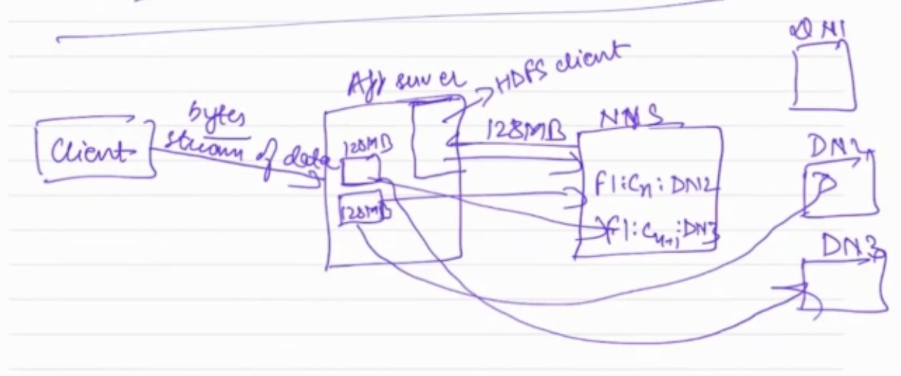

 What if file size is 200MB??
 * Then one chunk 128MB and another chunk is 72MB
 
 We do not aspect low latency


 ## Nearest Neighbors
  Problem Statement :
  * Find the nearest X number of neighbors
  * How will find the restaurent to minimum numbers of reaturant of particular radius
  ### Brute Force
   Find all resturant of the world and their latitude and longitude  and my latitude and longitude
   ```
   (x1,y1)-->(x2,y2)
   square root of |(x1-x2)|^2+|(y1-y2)|^2

   find all the distance of all resturant and find top 10 nearest distance

   It will take lots of time
   ```
### MYSQL
   suppose places store in MYSQL DB latitude and longitude store in it issue besause double is 8 byte later we solve the bit issue 
   Ractangle approach to make some sence 

   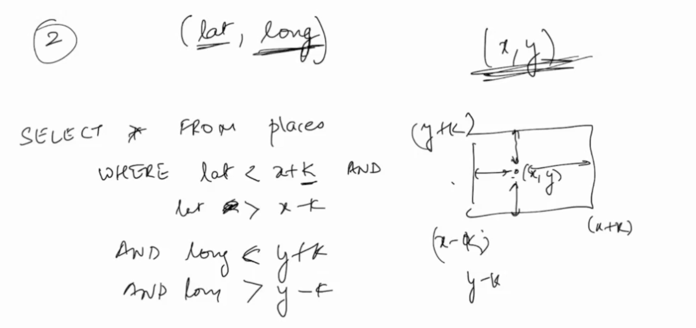
   
Pontial issue 
 * How will find the right K??
 * Query time query take lots of time ,
 double  does not have enough amount of precision will able to single latitude and longitude
 * If broken down latitue and longitude in multiple parts then do not have issue
 * If you don not pin point yours location it mean you do not have enough precision.It mean your location 100 meter above from booked location
 * Why precision issue happend because by default  all decimal number infinit in nature
 * How many number exist decimal point number exit bewtwen 0 and 1  it is infinit numbers
 * Useing 8 bit we can represent 256 combination numbers (2^8) but in between 0 and 1 infinit numbers of number possible
 Here there is precision issue 
 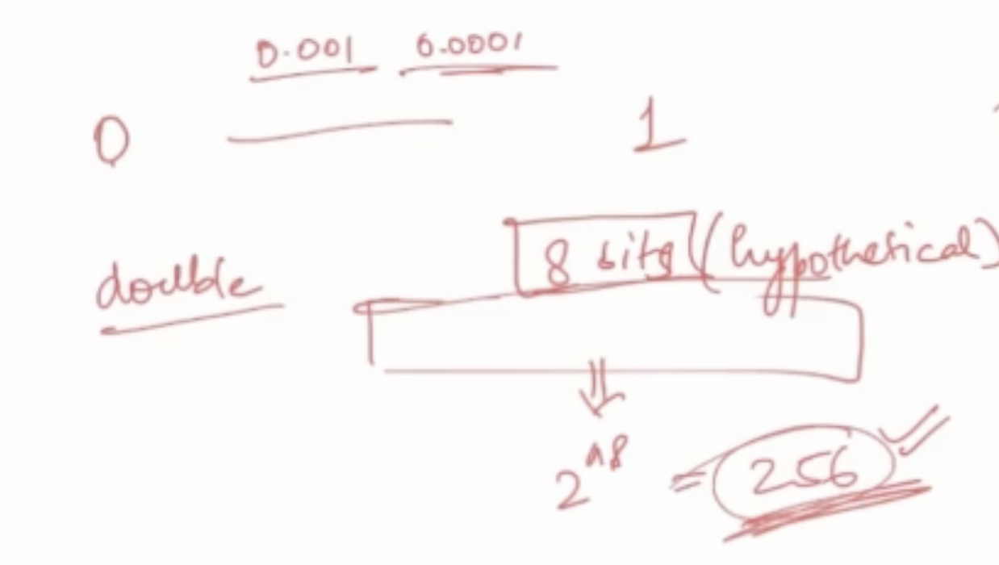

#### solve issue of precsion
There is 
```
lat repesent hypotheically
 lat*10^9
 max Latitude 180
 180.(9 places decimal)
  ( 9 places decimal represnt into)-->lat_int
  after this what will be remaining decimal represnt 
  lat_float
```

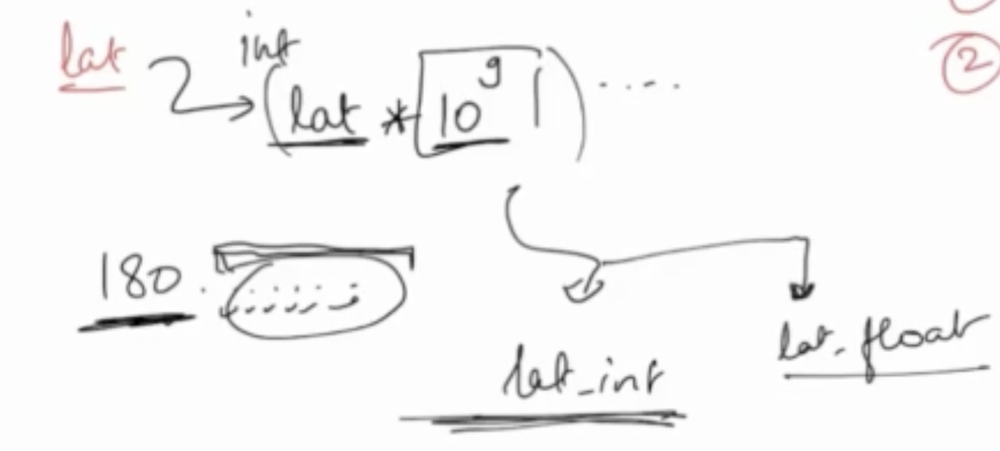


## Approach 3
Break entire world into grids

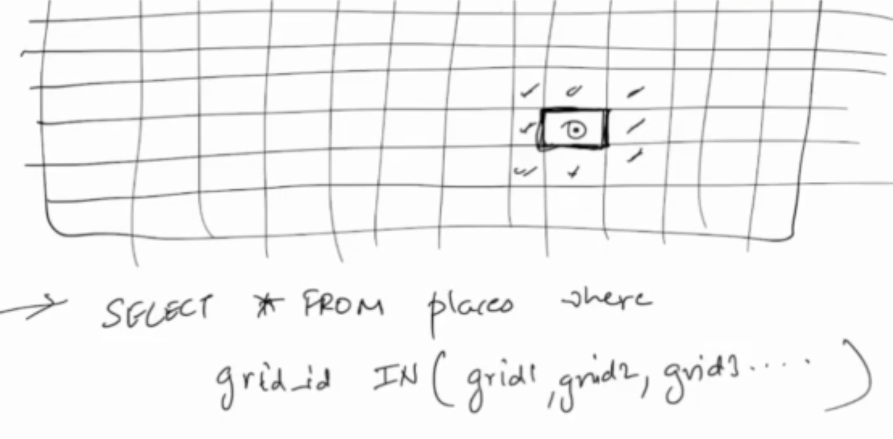

This is look very good therotically  but grid is too small and exiting location not come into this g
grid than call othere more grids then query become slow 

Better approach if area is dense the take small grid if area is parse then grid area take bigger this better than breaking etire world into grid

* Design veriable size of grid 


#### Devide the entire world into grids(Not equal size) so that every grid have approx 100 points How I do that??

Storing grid in MYSQL super easy
  
  SOLUTION OF ABOVE QUESTION IS QUADTREE

  ## QUAD TREE

  ```
  Every Node to ask do you have more than 100 points location if have then divide into 4 parts it will be recursivelly
  
  Hight of the Quad Tree O(log N)
  N-Numbers of places that is started with
  ```

  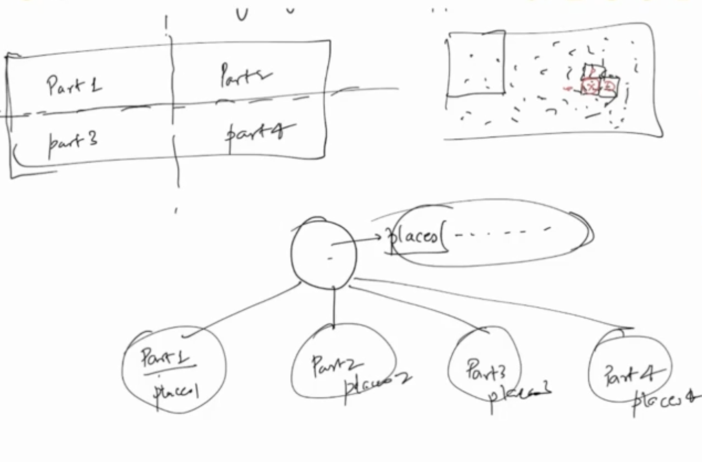

  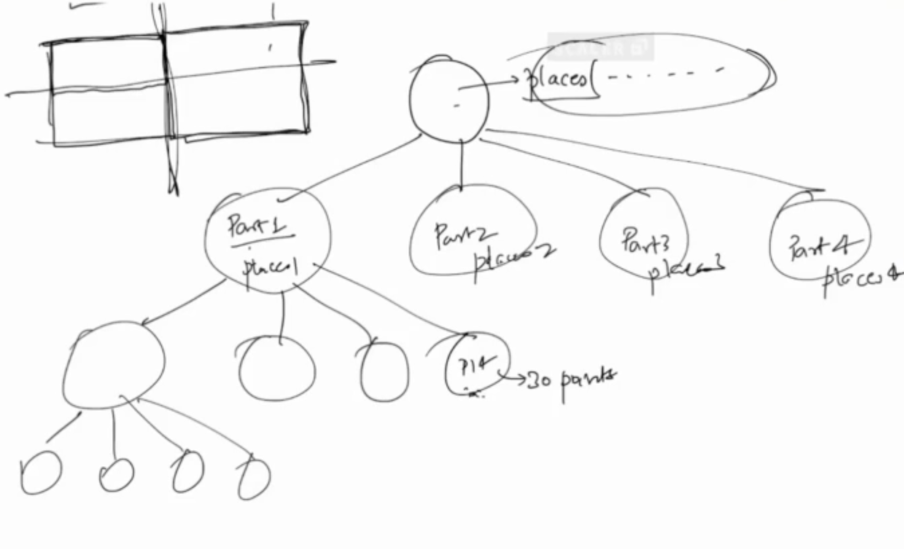
  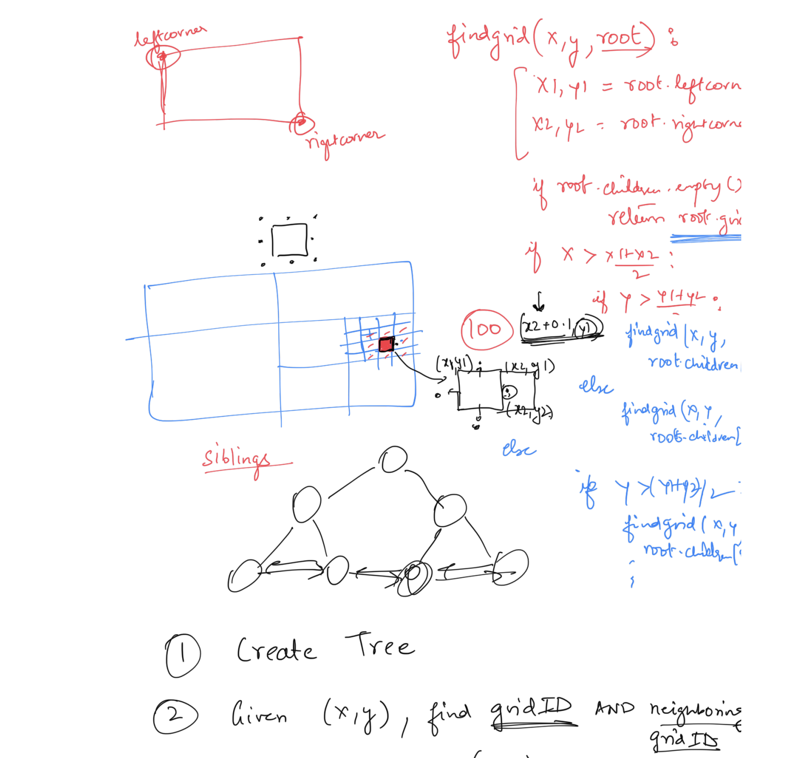
  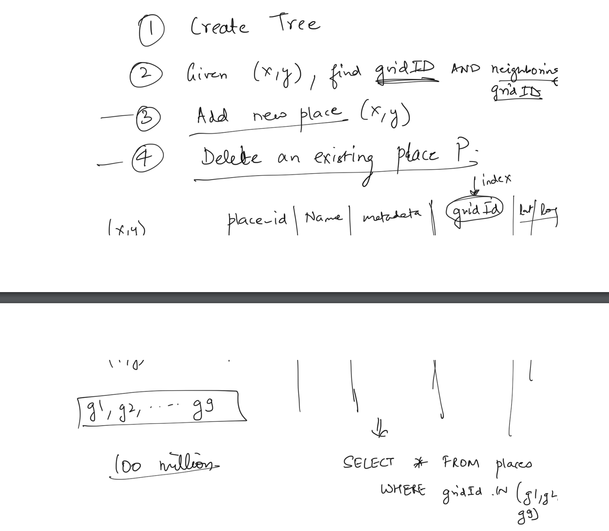

  *  How will create the Quad Tree
  *  Given (X,Y) How will find the gridID and neighbour gridID
  ```
  1. Find the place of given (X,Y) and find gridId
  2. Find all the sibling using Next Pointer
  ```
  
  *  Add new place (X,Y)
 ```
  Find the place , check if the current node has > 100 points, if so, split it. Or else just add in the current node
 ```
  *  Delete existing place
  ```
  Frst find the place  and check after deleting point  their points less then 100 points then delete all the sibling go back to root
  else delete only point
  ```


 In Real world  Where do I store the quad tree??

 ```
 1. System is read heavy system
 2. Very high availabilty rather than consistency
 ```

 There is 100 millions places can we store into single machine or not
 How much store needed to store 100 millions palces


 # Uber System Design

 * How do we store quad tree??
 * How to Quad Tree design for Uber
 * There is 100 millions places do we require single machine or multiple machine to store

 100 millions places stroed exactly once

 How many many nodes there is in this tree

```
 leaf node =100 millions
 parent of leaf node =100 millions/4
 parent of parent node=100 millions/16
 1 millions=10^6

10^8+10^8/4+10^8/16+10^8/64.............infinity
r=1/4

total nodes=10^8*(1/1-r)=10^8*(1/1-1/4)=10^8*4/3
totals nodes=10^8*(3/4)
```

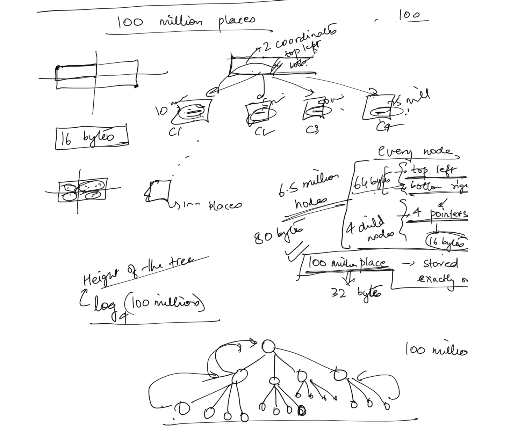
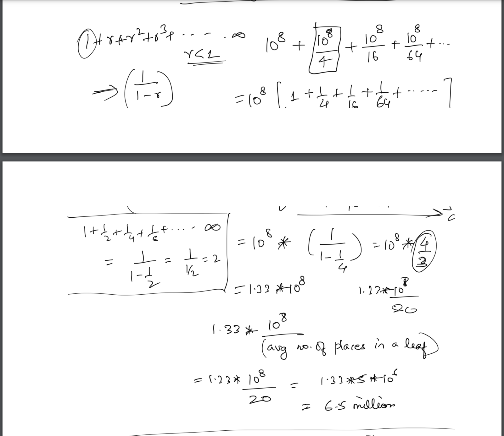

Totals nodes=6.5 millions
* In the worst case ,all places in the 4th level
* Some level shorter and some level larger
* we store co-ordinate or placeId something and meta data is stored into seperately in DB

* for leaf the data structure is { top left, bottom right, place_ids[] } ?

```

type Node Struct{
  topLeft*Node
  bottonRight*Node 
  4 Points {childrens nodes}
}

64 byte { topLeft*Node(32 byte)
  bottonRight*Node (32 byte)}
  because precison is double double --that is 16 byte

1 Poniter --> 4 bytes
4 Poniter--> 16 byt

 total byte:=80 byte


 space require::
 6.5 millions*80 byte+100 millions*32 bytes
 ~ 4000 millions byte = 4GB
 This fit in single machine in RAM
 

```

Uber is using same Quad tree but little bit complicated because location is moving

How Uber is work??

Intercity this is diffrent product we are not building this -> this is for different city and same city

Intracity same city

```
Requirement::

1. User take the Cab
2. Cabs 

Cabs have two state 
  1. Available to hire
  2. Unavailable(somebody taken the cab,I am driver and I am goen mark unavailable)

  Usecase:
    User at(Lat,Lun)
    match me with nearest avaiable cab

    (Notification goes in round robin 
    to these cabs here is rider 
    do you want to accept )->Yes/No

    10 Millions of Cabs 

    best sharding Key is City

    In city wise best case cabs 
     50000 Cabs

```

I am at location (X,Y) of city I want nearest cabs

#### Worst Case Solution 
* Brodcast all the cabs and filter in cabs level if you have to show or not
* Brodcasting the cabs is very very expensive because every single time lots of person requesting the cabs 
* you are braodcasting messages to 50k  diffrent cab ids may be avaible that point of time .it is very expensive

####  Dynamically changing Location Solution
* cab ping the location is avaible every time  using websocket
```
Recent Loction  car_id-->(X,Y)
```
```
Lets have 
In-memory  Map
Redis
Key     Value
cab--> most recent known location

cab is sendin g location every 1 minutes if they are active and moving 
```

#### From Driver Side app optimization

```
send location 
1. only when my location has changed in last 1 minutes
2. If the driver app knew . the grid part of instead of rely on Quad Tree
2. If driver know the gridId and also know the gridId boundary and if it is moving within the boundary it's not need to update Quad Tree , only problem is moving beyond the boundary

3. Beyound the gridId then my location is changed then send to in memory Map this is my new gridId
   Operations happends after that 
    1. Delete old one point in gridId when changing location
    2. Add new one point in gridId when changing location
```

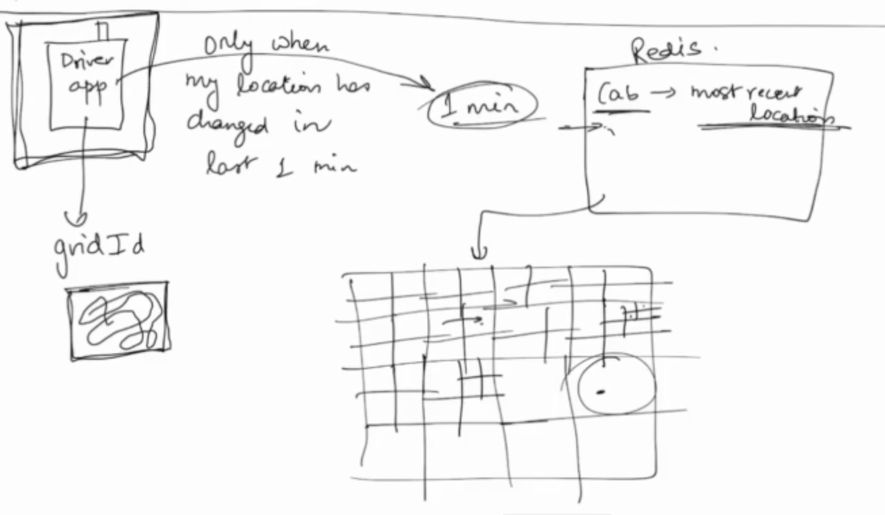

Do we need to create child node immidately or wait some time??

```

Suppose every grid contain 50 cabs it is thresold


Range 50-75 cabs
if I am ok if cabs is reaches 51  because cabs are moving but if cabs 75 then we have break further in 4 parts
```

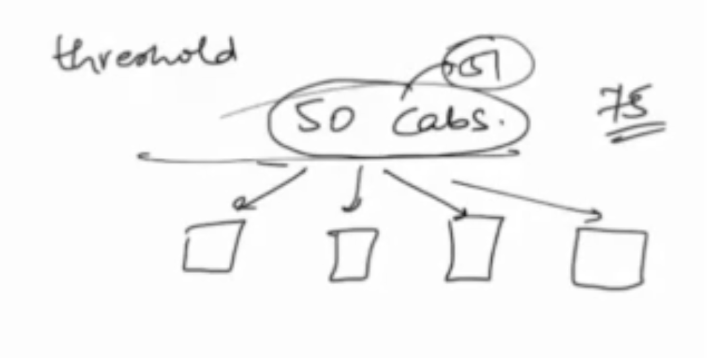

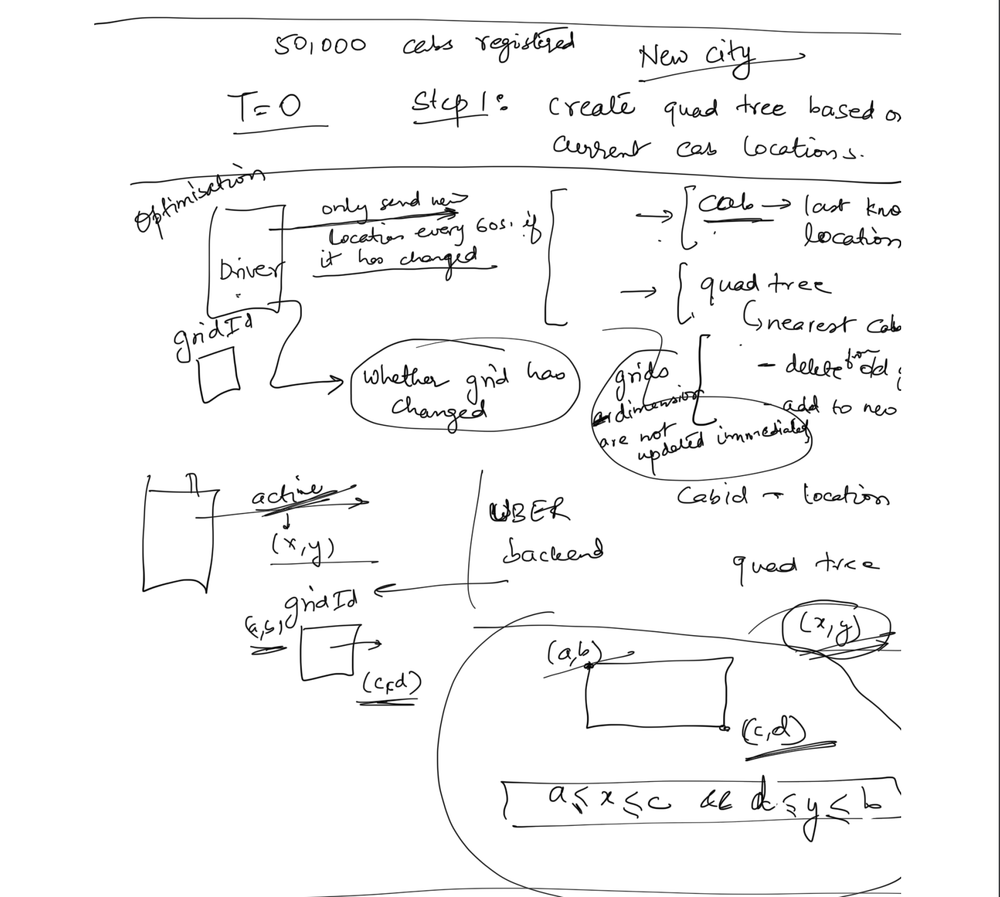
```
Periodically ,I update grid dimenssion if needed

Probably It have  per hous, per 2nd hour,per 3rd hour

grid split in 4 children
4 children merge into a grid

1 Hash Map
cabId--> last known location
if location is change but gridId is not change then update only HashMap

2. Quad Tree 
carId-->gridId ,neighbourGridId

if gridId is change the update in QuadTree and also update in HashMap
```


# Design Hotstar

This is injestion pipeline

Step1: One person is uploading content on Hotstar there is multiple view consuming by user

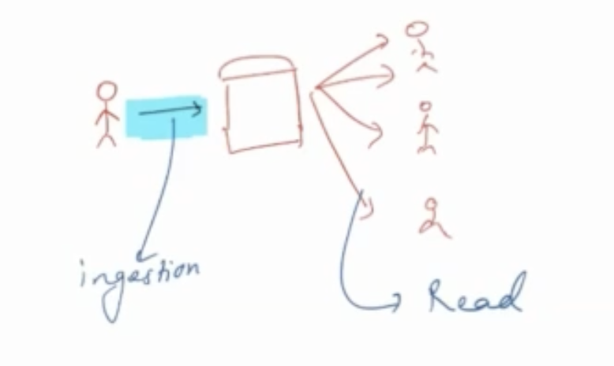

I AM GOING TO DISCUSSING THE INJESTION PIPLINE

### Requirements

```
1. Admin user must be able to upload the content
2. End user filter the content by genre,language

multiple step invole in jensetion pipeline eg whenever I upload the vedios there is auto generated thumbnail,I am only uploading to higher resolution quality qualities so I want to from stem generate lower resolution quality

3. Generate lower resolution vedios and thumbnail
4. Apply geo restriction
```


Therse is user uploading vedios to central server to a DB


### Scale

```
1. Numbers of vedios available on Hotstar is 1 million
2. Avg size of the each raw vedio file arround to be 1GB
```

### Storage 

```
 storage =1Million*1GB
         = 10^6*1GB
 storage =1 Peta Byte=1PB

 what is 1PB storage data ?? 
 This is binary data (raw data )
 is it querable formate ??
 it is never be query on this data

 So this data is no querable data  that is store in something like file system in S3 also strore in CDN

 store in --> S3 or CDN

 what is amount of storage require??
 in Database 1 million of metadata require to store 
 
 Suppose  1 entry of meta data taking 1 KB stoarge then

 Total storage in DB = 1 Million*1KB=1GB

 1GB data easly come in one Machine it don't want to require multiple machine it iseasly fit one machine easily

 Lets evaluate the RDBMS system for storage in DB
```

### Schema

Entities

```

1. User -->uploading vedios
2. Vedios--> metadata,resulations,language 
3. Genre(Comedy,Horror,Thriller)
4. Language-> Hindi,Hnglish,spanish,German
5. Country

What kind of realtion between these above enties

User has one to many vedios (1:n)

Vedio has many to many Genre (n:m)

there is another table require 
Vedio_Genere
id --> not require because the locality of reference
vedio_id
genere_id

-->id is not require because locality of reference

-->What is primary key that decide the physical ordering in hard disk

-->fetching the vedios it is faster if be do not include the id fetching through vedio_id beacuse it is decide the storage in hard-disk beacause of it is primary key

Vedio has many to many Language (m:n)

vedio_language
vedio_id
lang_id

Vedio has many to many Country (n:m)

vedio_county
vedio_id
country_id

```

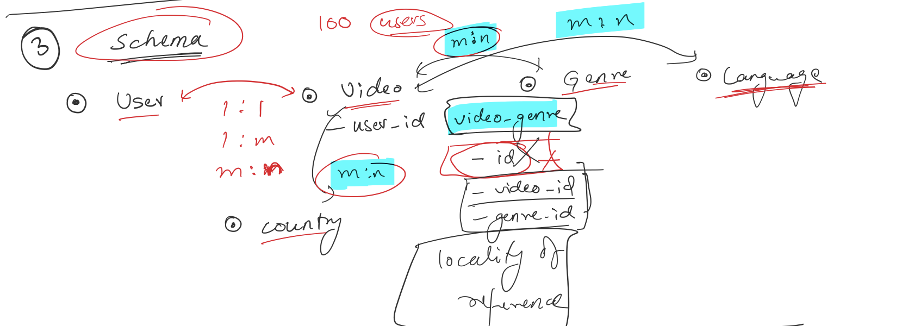

### Design Goals

Before you answer wether we would want AP system,CP System,AC System, Look at the what the number we got  amount of data we want to store in RDBMS it is 1GB

--> 1GB Easily fit in one machine

Data can fit in one machine  lets evaluate 
```
CAP 

C-consistency
A-Availability
P-Partitioning

Chat based system use CP
Hoststar using AP system
```

#### CA System

Data can fit in one machine  so we do not neet of partitioning

What is implication of CA??

Data would be thier in one Node
* What is problem entire data lieing in one node  
* If we are replicating the data into another node that mean we are including the paritioning
* Parition does not mean that is only the sharded data
* Partition mean that data is residing more than one machine and it has to synchronize between two server call parition
* That mean we can can replicate becase this partition

```
CAP does not work for single server 
if more than one server tha apply  CAP Theorm
```

My concern in CA system it has one server if it's die then it Single Point Of Failure. 
```
If this database is down then Hotstar user unable to see the content
```
Availability does not take in accont server crashes

```
Whole crux of CAP Theorm , 
Whole CAP Theorm does not take into account
if your system is down for eg turn off your cluster

I do not Availability
I do not have Consistency
I do not have  whole things
basically I do not have anythings

CAP Theorm based on the assumption 
Entire system can not be malfunction
```
Avoid single point of failure we need replication

What kind of replication ours use case would have??
is it work with eventual consistency or need of strong consistency

* Eventual consistency will work reason that we do not need stron consistency becuase Rate of TPS entry is made very low since quite low .there is very less change to corrupted to any kind of deplay

So here we have paritioning CA system does not work 

Thre is need AP Model because it is evventual consitency

Here AP system model will work

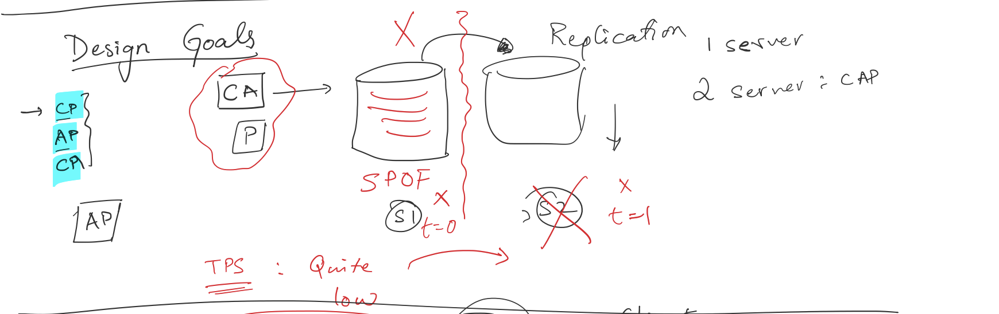

### Actual Design
Most Bruteforce 

There is client calls to upload API ,upload API transfer the file metadata to server  we send everything the data to Database and file send to S3


TPS is quit low because not every day admin uload the vedios

What is pros of this approch??
* it is simple 

Demerit :
* We will inroduce the very very bulk code base.
* Parallel excution is not there.

##### Client upload the vedio
when client uplaod the vedios there is multiple step


```
step 1: Check the error (corner copy right voilation)(it's take seconds)

step 2: Whether that vedios uplaod to perticular geography location (it's take minutes)

step 3: Generating lower resolution (this compute intensive task it will take hours)

step 4: manually process and manually approve by somebody (it's take minutes)

step 5: it's take seconds


```
Each step take varying amount of time 

* This is very lengthy process there is multiple steps involve  
 * There might be manual step as well

 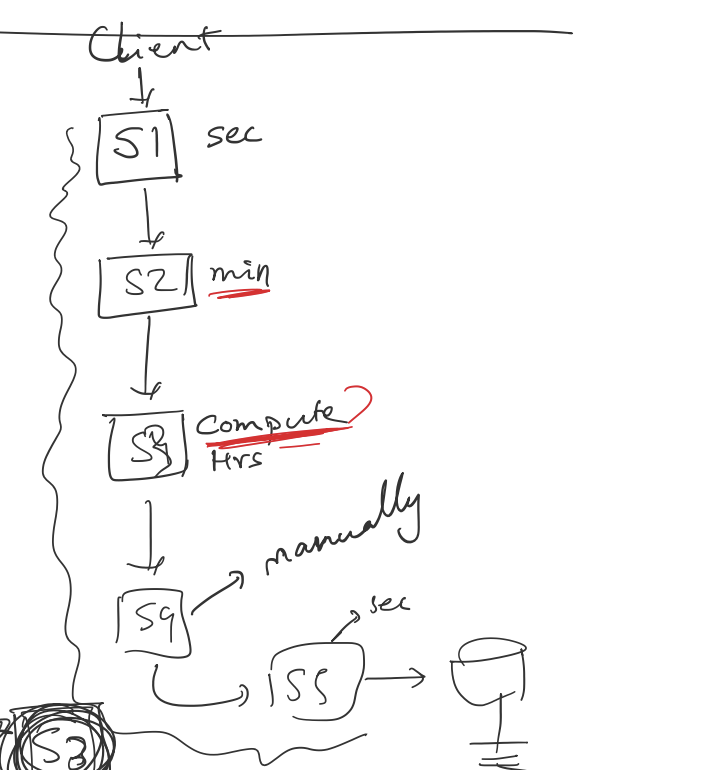

 If it is taking hours to complete  it can not keep file into memory ,every task is done then send  particular status to client

 needless to say this can be Sync API it has to be Async API 

 if this is going to be Async API ,can I make use of this Async status  an does make sence ton add status field what is status of particular file 

 ##### Aysnc

 ```
 step 1: Uplaod to S3
 step 2: Update database with S3 URL
 ```

 One more problem  step 1: is fail,then we have uplaod the vedio again

 there would be network wastege then offload the uplaod diretly to client in S3


 insead of sending request to client send directly request to S3 , we are saving the bandwidth to Server that is client 

 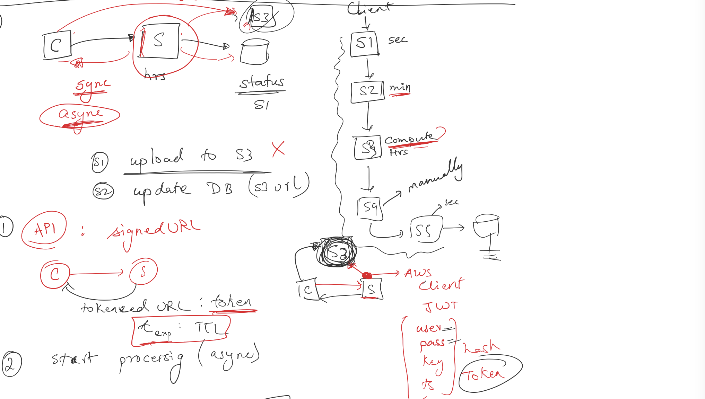

 How will do this ??

1. Creating an API 
```
1. API : singedURL
```

######  SingedURL
client call to server the server generate what is called tokenizedUrl  This tokenizeUrl have access and time expiry attached to its

It have token we can give any who want to call particular API given time frame ,it have TTL
When uplad to S3 and tell to server I have loaded into S3

```
tokenizedUrl: {
              token 
              ttl
              }
```

```
2. API :: Start processing call (Async)
```

If second API is Async then we can introduced the some Queue here

client has successful uploaded file in S3 but Database does not have infomation that file is uploaded into S3

Therse is two ways make this works:
```
1. Client one's file uplaoded into S3 then call Server  then server update particular record and start doing s1 to s5 steps 
```

there is possiblities  we bombared more requests that my server 

I have bombarded requests very quickly i have to reject all those request above with my thresold and then there will no traffic and end up with again come to API than can handle 

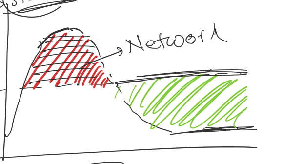

Above the thresold my system unable to process becasue Unable to handle it 

For this I have add Queue in bentween server and Database

Whenever client uploaded the file into S3 there is one job added into queue and all details of the jobs push into database.Database row contain the status  and Status is contain the state  are  we processing step1 or step3 or last step

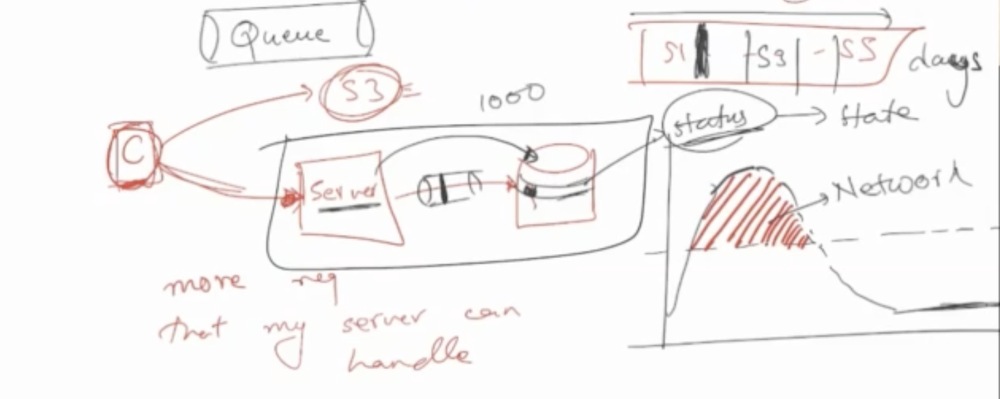

What are the good things about this design ??
* solve for network
* If this start to process  it might take to day 1 to 3 because this manuly process .So we need to queue to maintain what step process I am processing and enqueue again so that whenever I have time  worker server available that process which step is rejected
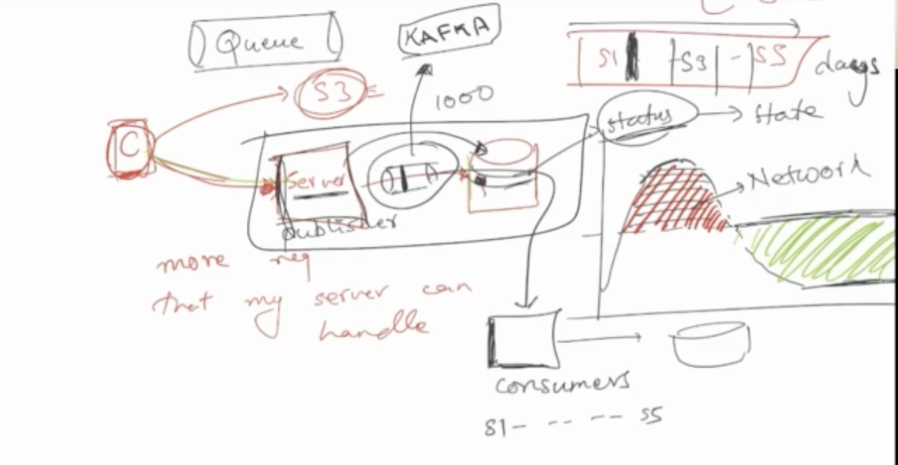

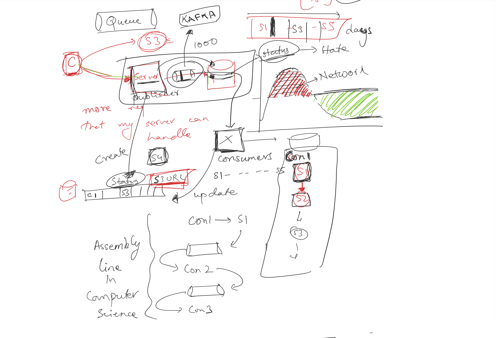

1. First approch is working sequential in queue (Assemby line)
2. We can achieve using parallelism using DAG directed acyclic graph .That is Natural ordering depencies (topological sorting) and preserve the state and start executing

How the execution look like ::


Whenever s1 and s2 start to processing and store into queue when both will complete the process and it status s1 and s2
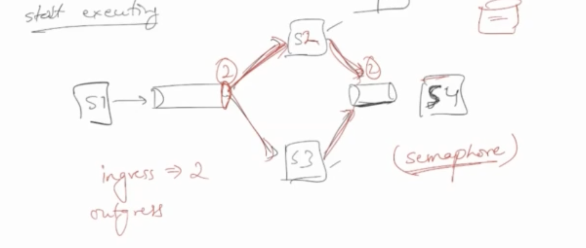

How will achive this??

Any time I am maintaing::
```
Ingress:: How many async task originated from server queue

Outgress:: How many coversing to that task in next queue

This problem solve by Semaphore

Semaphore ::
How many arrows goes out and how many arrow goes in
then count goes to zero  that mean i will inseted to Database
```

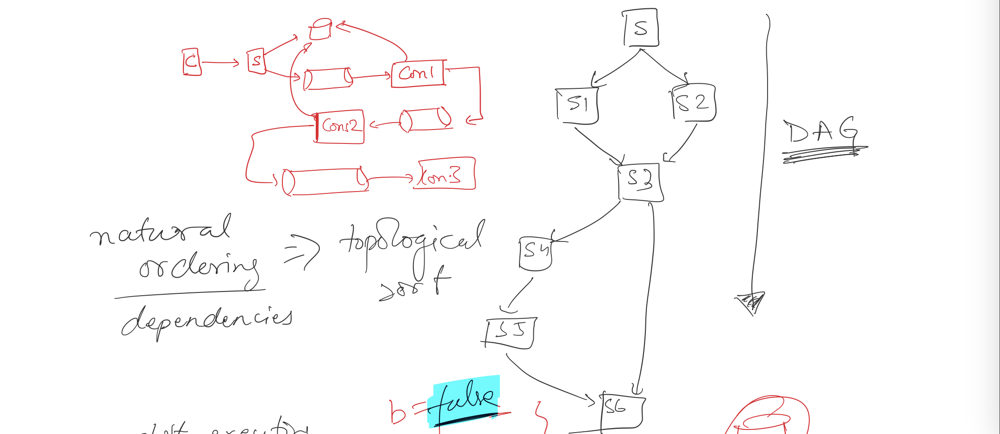

### config System 

Pre URL store in database

that can be done throw config system 

```
preUrl/row-files

preUrl/1080p

preUrl/720p

preUrl/320p

```

#### Retry Mechanism

```
table

time_updated      status 
t=0                s1

thresold time for s1 step is 10 minutes 

Every 60 minutes Schedule will start and chek that thresold time exceed than Restart particular job

In this case s1 will restart

```

### Chunking

if we want get 1GB data file from S3 there would be very slow and it will buffering 

Lots of time to send file


This kind of system no one happy even one user will not happy with this 

The way to do this is create small small chunk of the file and send back small small chunk back

Luckly S3 support chunk download

if I make 100 chunks and 5 threads to downlaod to these chunks. Then order will preverse of chunk 

Maintain order of the file using 

##### Manifest file
Whenever we send the chunk we craete the hash of it  and oder of hash maintaining into Manifest file 

manifest file 
```
 boolean flag it will show is it download or not

              flag
hash1 chunk1   true
hash2 chunk2   false
hash3 chunk3   true

using this information manifest file send to Player and player taking care of fetching the next chunk that how  serve to particualr user 

For live streaming manifest file keep updating  new row into manifest file and player keep fetching new row 
```

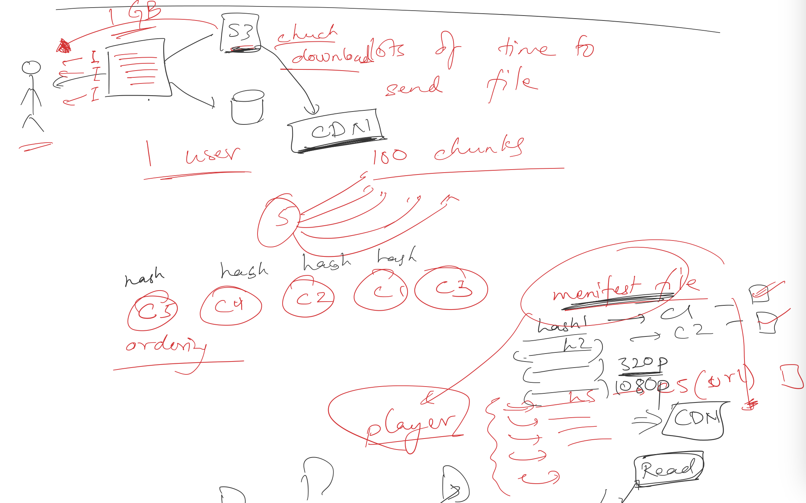

Make the vedio globally and create multiple copy for faster access  what happend after uplaoded to S3 after that push to CDN using this it is distributed to everyone 


If you have low TPS you will get all CAP


# IRCTC System Design

## Requirements

* Search train : source and destination
* Sort Train based on time and price(But this is UI part frontend)
* Availability per calss (sleeper/AC-1-2-3)
* Payments(3rd party service)
* Waitlist-->Persitence in Queue but this chioce you want to take waitlist or not
* Book tickets
* Cancel tickets
* PNR ststus/Booking History

How will implement multiple stops??

GOA MUMBAI  KOTA  DELHI
* yours ticket book from Mumbai to Kota this is assumption
* My design right now direct GOA to DELHI design I want to increase complexity of the system ,We are taking only from to  not in between I am taking

this merge interval type problem

## Scale 
```
1. There are 4000-5000 trains PAN India that are booked every day
2. How much storage would be there
3. What would be the QPS
4. How many boggies in train
  20 boggies in each train 
5. How many rows in boggies
  20 rows in boggies
6. How many seats in per row
  8 seats/row

7. Assume all trains fully booked

totals number of seats to book 
 =5000 tains*20 boggies*20 rows*8 seats
 =16 Millions
 totals seats =16 Millions

 Waitlist is 20%
  Then Total requests comes per days=16M+16M*20/100=19.2 Millions

  Total requests per day=20 millions approx

  8. This data  booking keep in for 120 days

   -- Beacuse only booking windows open prior of departure of particular trains
   -- After train will start jounery is booking data require ?? only for auditing perpose required but this archieval data 
   -- data is older than 120 days pushes into S3

  Data storage require ::

  20Millions*120 days
  2400 Millions
```

status  whether is it book or not
#### Amount of data store require:
```
Booking Table

ticket_id(id)
user_id  32 byte
seat_id  32 byte
train_id 32 byte
src      32 byte
dest     32 byte
date of journey 4 byte
amount   4 byte
status   4 byte
PNR      4 byte

total byte for record=175 bytes 

 ~ 200 byte

 total storage =2400M*200=480 GB

 can data store in 1 machine ??
 we can stiorage in 480 GB

 this is hint we can store the data in 1 machine right now we are not taking decision to take database


```

#### Calculate the QPS(Query Per Second)

```
Successful Write QPS

for all seats we aree doing write 
--> 20 millions per day

calcuate per second :: QPS

Max QPS at the time of Tatkal Booking
1. 30% of booking done in a day are Tatkal booking
2. All 30% booking done within 10 minutes
3. What is Max QPS??
Max QPS=(30% of 20 Millions)/10*60+(70% of 20 millions)/12*3600
= 10K request/second

```

```
if I need to 10k trasaction in 1 sec and just have one thread 

10K txn-->1sec

What can be maximum latency of 1 write??

10000 txn=1sec
1 txn=1/10000=0.1ms (so 0.1 ms is not enough)
 Then how will increase the throughput

 So we need to multi-threading
```

```
if it has singe-core-processsor
what is number of write at given instance like t=0 is 1 write

single-core-processor
time   write
t=0     1 instruction

Run 10000 instruction or write parallely also complete in 0.1ms

This is fine latecny 

any application latency between  1ms to 700ms is fine


suppose 10 ms take to write and store in database time taken by 10000 thread 

10ms latency=10000
1ms=10000/10=1000

There are require 1000 threads to complete the tasks 

one thead write one instruction in 10 ms
then 
in one second will write the 100 tx

1ms =1 txn/ms=100txn/sec
1 ms= 100txn/sec

So there is 100 thread require to complete in 1ms all the instruction 

```

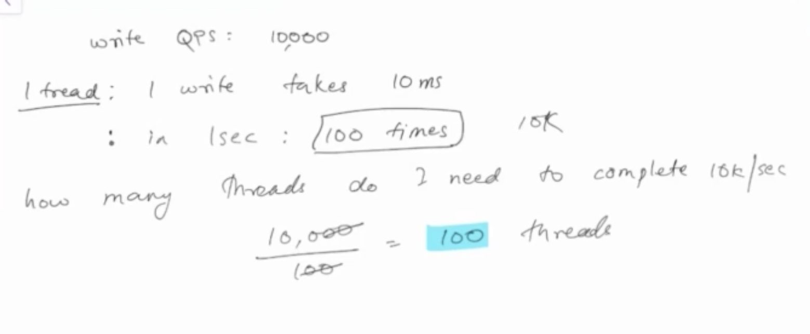

is there any limit to execute number of threads in CPU??

```
# of instructions your CPU can handle in 1 sec=2.2*10^9 per sec

= 1 Billion  instructions handle by CPU in one Sec

One of the responsibility of operating system  give eqal opportunity of all thread

So there is context switch 

```

How many threads can actually write at very very  same time  this is parallelism
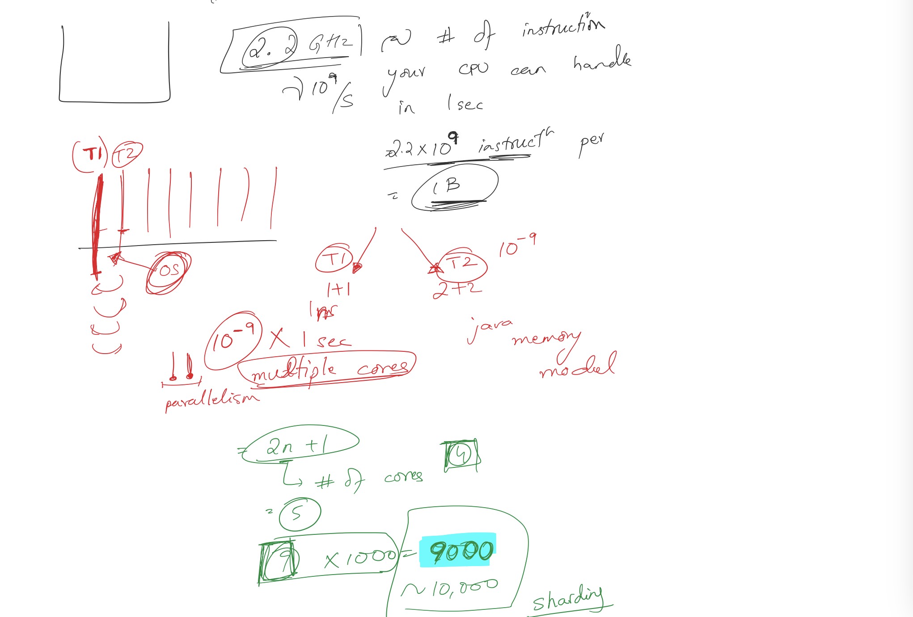

```

CPU take some to when has to switch between threads
there are  CPU cycle there are nano seconds waste from thread 1 to thread 2 when increase the number of threads in ours system instead of inreasing the performance ,degrading the performance
```

```
Idle numbers of thread=2*n+1
n is number of cores

if n=1
idle # of threads=3

if n=2

idle # of threads=5

These all are user threads and application threads not os threads
```


## Non-Function Requirements or Design Goals

```
1. Consistency
2. Latency: few seconds
3. Highly concurrent system
```

## API

```
search(src,dest,Date)
return list of trains (it have availabilty of seats)
```
```
Book(train_id,noOfTicket,class,user_id,src,dest,date)
```
```
cancel(ticket_id,user_id)
```
```
getStatus(ticket_id,user_id)
```

## Services

1. Search Service (M1) just static infomation
2. Availability Service (M2)
3. Book Service (M3) (After chooseing the train paymnet generate and sed to Generate Service)
4. Payment Service (M4)
5. Complete Booking Service (M3)

Search is independt what is happend in M2 and M3

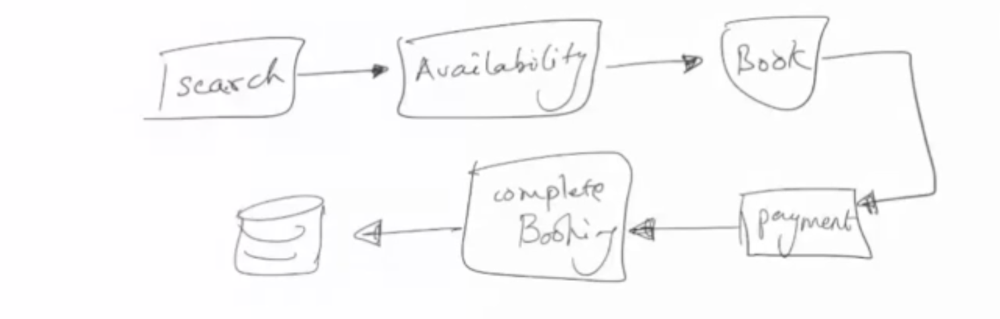

Serach is staic data not growing and update frequent

Start with monolith just two sense here:

1. Command and Query Responsibility Segregation (CQRS)
 * typically tapically go with CQRS
 * it is seperate Read and Write

 If some one search trains if it is not find out it is come out  so there is require Search Service

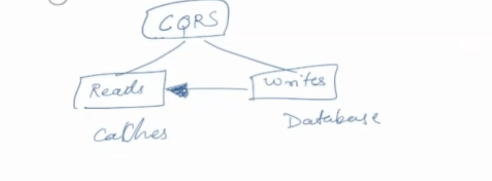

```
Static data: trains,Users(Most Search request coming)
Dynamic Data : Booking/Availability

both have diffrent scalebility requrement
So there is require tow database
--redis
--RDBMS

```
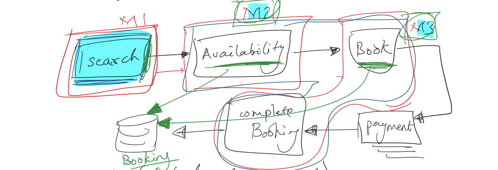

is M2 and M3 should be single service ??
1.  Before doing the book first check the availability


### Sharding

1. train_id : we have train_id as sharding one of the problem let's suppose I want to fetch my booking that is already done 
  * Train 1(DELHI-MUMBAI)
  * Train 2(GOA-MUMBAI)
Fetching my booking query call to multiple shard
  * fetching my booked ticket is slow

  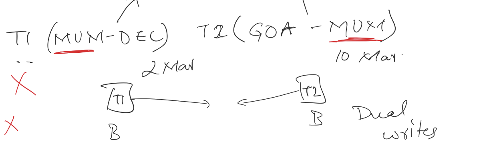
  Whenever is dual writes ,we have distingues the source of truth  so source of truth dynamic data that is booking service and also write into User that is static data
  * keeping train_id and duplicate the purchasing history that is solve my problem
2. seat_id--> Not possible
3. user_id--> not possible
4. city_id
5. destination
6. Date --> this working as shard key and also IRCTC also using DATE as shard key 


there is 1 hour maintainace window , at which 11:30-12:30 website is down 
```
tables it will  1 millions read all from booking tables 
and update the User profiles from booking that is user done these are booking from that date or day

1. It will not work if problem of QPS
  -- reason maximum QPS come in a particular day so all the query will hitting the particular shard
2. It will work if problem of storage

```

if i have design the system I will choose the tarin_id is sharding key

### Replication 
Just avoid the single point of failure then relpicate the data

##### Leader and Follower Model

Quoram Approach 

```
Read+Write>RF
RF-Replication Factore

It is give strong consistency
R+W>RF
```


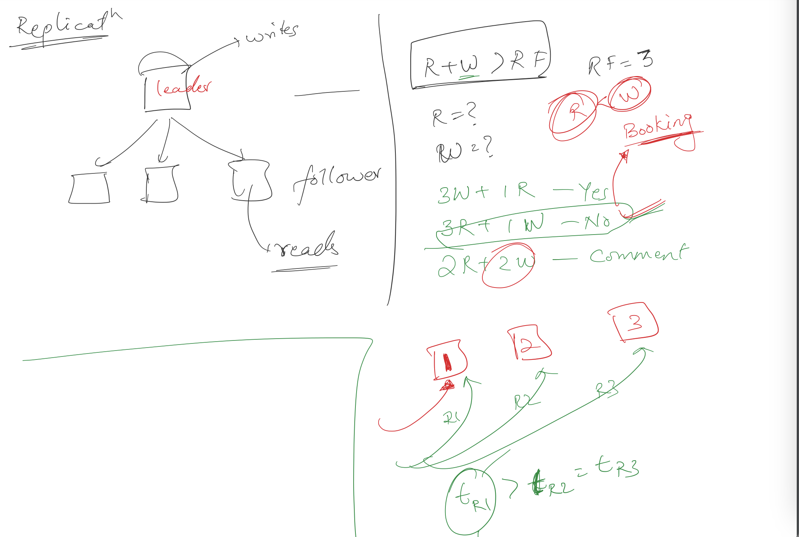

### Concurrency

Concurrency issue:
* There are 100 inventory avaialbe for the 100 inventory 100K people want to book  this ticket 

How can do this without impacting user experiance ??
* Whoever to come first and book pariticular ticket
* To book particular ticket to book a particular ticket ,I know the  high TPS  is only for 10 minutes
* What easly do it ,I can offload actual seat allocation to a later time  for that way I do not search particular ticket  particulat fee allocation 

  1.  Hi this is your seat number and this your PNR number and this urs fee ticket ,We are goen sent to you email id 
  2. All you do neet to you maintain a counter and decrement the counter as soon as you get request and associate ID and aprticular User


#### Brute force solution for Concurrency
  ##### Rate limiting  Brutforce
  Get 1000 request persist in DB then run batch Job on their current timestamp as soon as  this number 
  reaches 100 request I will start rejected future requests
  
  After the tatkal spike is gone we run the Batch offline Batch analysis to allocate the seat to every passenger who is trying to book 

  1. I want to associate the particular seat_number with it  what is easiest data-structure to do this ??

  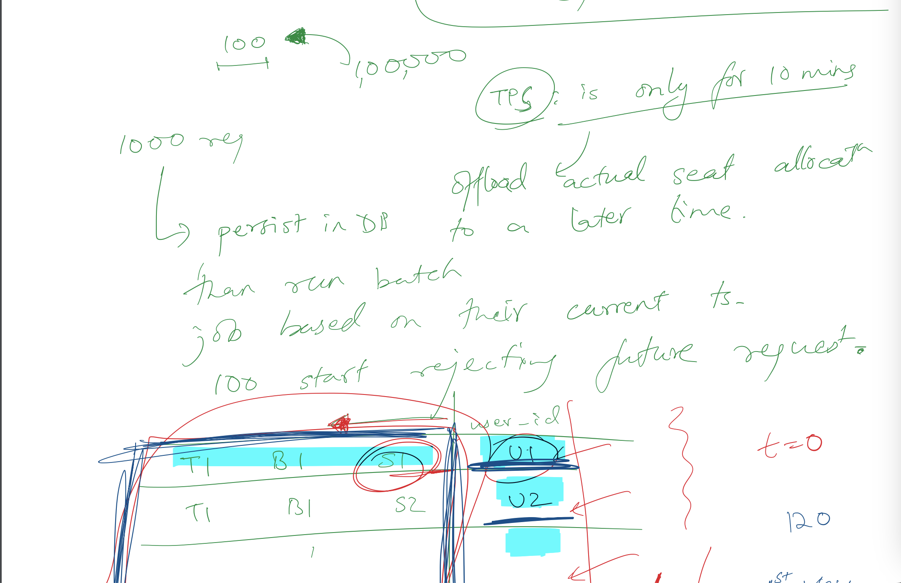

  ```
  My rows goes something like this 

  initaly left side all data  is filled 

  Whichever user come first I will associate the user on it

  We take the perspected lock to my seat  I do not have the lock on particular row because only I am adding user  U1,U2.U3 when payment is done 

first WHo have completed the payment who entered in table mean allocated seat ,Rest will be waitlisted and trigger a refund process fee  ,people who not able to get threw  there might we cases  there are lots is data is empty that is fine 

Lets look the corner case I just have last seat avaible 
my application servers the AS1,AS2,AS3,These are trying to book a ticket for U1,U2,U3 all of them trying to acquire the lock on the last resource ,First one Who is avaible to acquire the lock and complete the trasaction and trasaction return error to other two ,only one able to book a ticket  does that make sence

Problem is that maintain the lock for some time  like BookMyShow  allow to hold ticket  for 15 minutes after it's  expire  .The way to do that again using DB clock itself  and attached the timestamp for how many timestamp it is done ,Every 10 and 15 minutes  you refresh and run a cron job ,If this is still in trasaction mean this transaction not complete remove this trasaction  for refund it 
                                     user_id

  Train1     Boggies1     Seat1
  ```


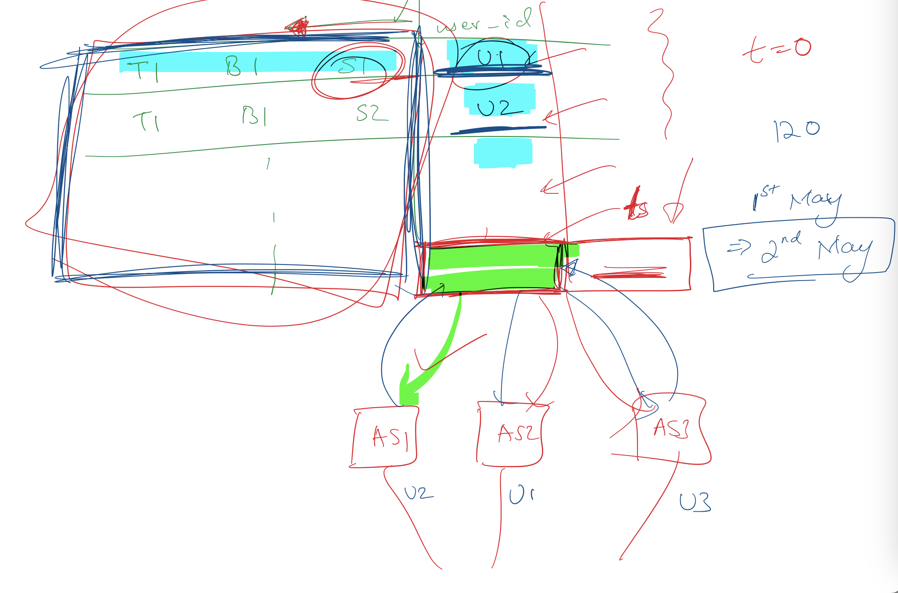


There is two cases for timestamp 

1.  Where we are not holding the inventory and making the purchage and only updating the record


2.   Lock the inventory for particular time
  

We have invetory for column user_id and timestamp


Lets suppose I do not want to block  particular seat for any user 
Then This timestamp is required for purpose of locking (sudo locking )This timestamp immatrial  when we are not holding lock for sometime  

```
Most of e-commerse website there is flash sale for Apples iphone Those are based on the same prinples those hold the inventory for 1 minute or 2 minutes for complete the payment ,If you don't make the payment within that time then this inventory release for everyone
```
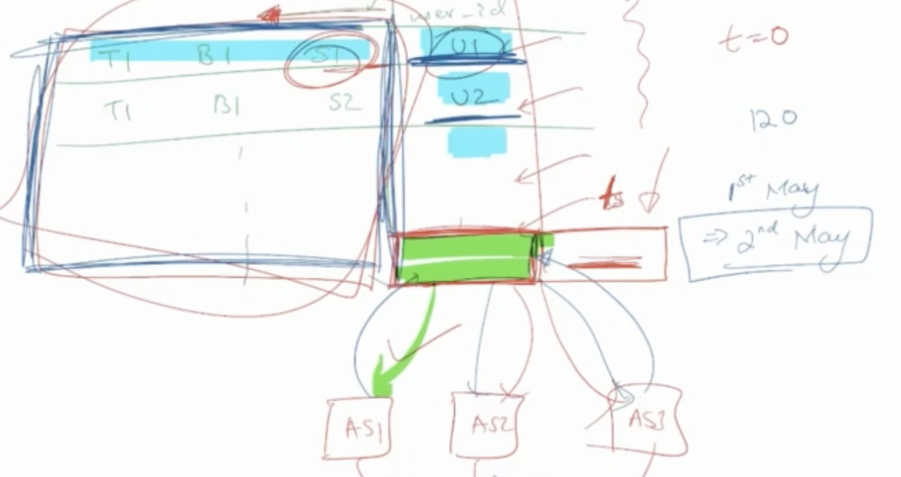

If I want to hold the inventory before doing the payment there is another column require  time_created and another column is_Paid 

I am blocking the inventory lets suppose for 5 minutes
you have to do the payment within the 5 minutes otherwise yours ticket goes away

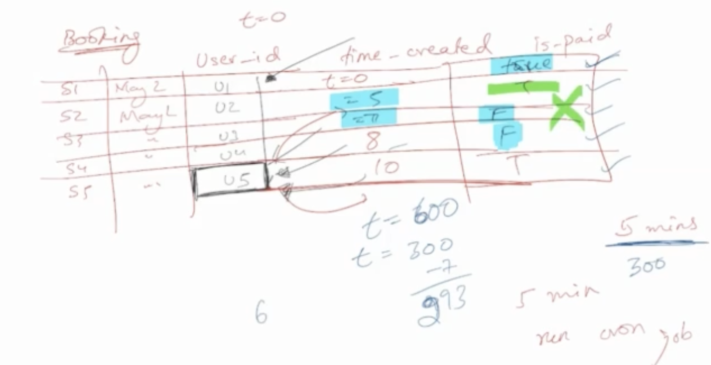

After 5 minutes I will run the crone job to figure out what are the entities payment is false and 5 minutes is elpse I have to need free this resources 
at t=300 seconds I run another job
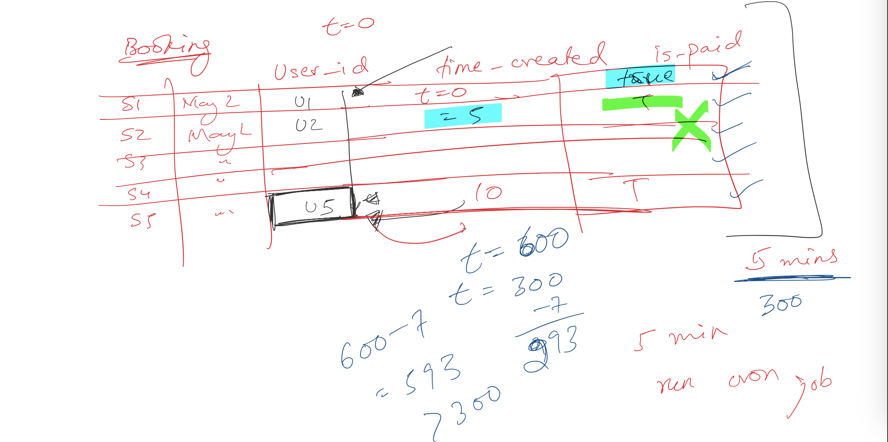

