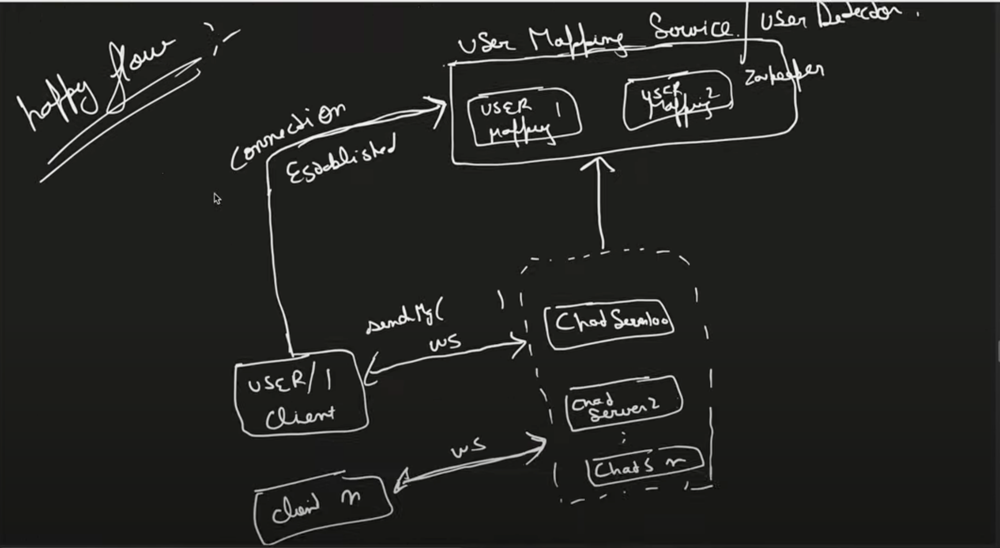
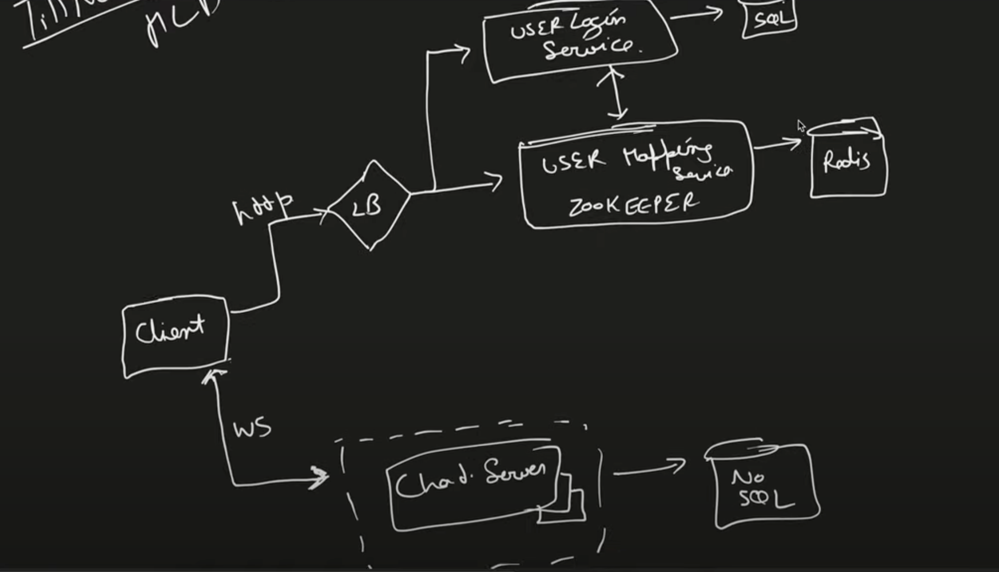

## Whatsapp System Design


### Functional Requirement

```
1. One to One send and recieve messages
 for the simplecity we are working only text

2. Group Message Support

3. Last Seen  online/Offline

4. Login User/Authentication
```

### Non-Functional Requirement

```

1. Scalibilty
2. Low Latency
3. Availablity
```

### Scale Estimation

```
Assumption
1. Total users is 
   1 Billion
2. Daily Active Users
    50 Millions
3. One User can send 
    10 messages to 4 peoples in one day
4. How many messages per days::??

=40 Millions*40 messages
= 2 Billions  message/day
suppose 1 message allow 100 character =100 bytes

=2 billions*100 byte
=200 GB per day  store require


Maintaing the Messages for 10 years

total store =200GB*365*10 years
= 732 TB
```


This an my UserA and UserB if its IP address you can directly communication you can say peer-to-peer to communication


This is not scalable 
There is taking to each other we have to maintain chat history

How this possibl in peer to peer??

There is UserA nad UserB they taking with each other by a Chat Server They not taking directly reason that This basically Client-Server-Architeture

Chat Server  will reponsible for 

```
Scalability
Groupiing 
Avaiablity 
Chat History

```


So this is not perr-to-peer 

UserA is sending message to Chat Server i want to send message  senMessage() using http protocol it is based on the request response based

Chat Server send the message to UserB

For The recieve The message does Http work No because WHy 
Chat Server inite the request this not possible  it is always is initated by client 


Then WHat shall be do ??

There is three way to achieve 

1. Polling

Polling is a method by which a client frequently asks the server for new data.

Polling is not scalable


2. Long Polling (Pushing )
  There is enhancement in pooling
  It is ask to server is there any message if no then it will be wait some thresold time 

  

3. Websocket
It's bi-directional persistance conncection
```

1. First make a connection (Handshake)
2. Server Will Acknowledge it

3. After that above step It will setup bi-direction conncetion

Peristance mean connection will remain open it will not close ,It will only close when one of them  shutdown the conncetion or internet brakage

```


there is user1 have websocket connection with chat server 100


How does know that there is 1000 of chat server

How does chat-server-100 will know which chat-server we have to send message  which is User2 is conncetd to that server

There is another server User-Mapping-Service


What does not maintain the chat history 



If you want to maintain the chat history you have add Database

But 
Which Database you will use??


```
Read:

1. User1 can read any user message 

What are have the conversion with him/her I will the conversation

2. Group Chat history I can see
3. Group Memebers profile details I can see

4. I can see my own profile

Write Operation

1. Send message 
2. Update profile piture 

Are complex joins have you seen in Read Operations--No

Billions of message per days and I have long chat history 1000 connection in my chat history ,I want to search in history

Low-Latency Serach capability--Key Point for No-SQL


### NO-SQL 

  Discord is using Cassandra DB

  Message Id is using for sequencing 

  

  Inside the particular Partition Key  base on it Which chat history will go

  Now on perticular chat I want to maintain the sequence


to generate the


```

To generate the messageId  using Local genertor+timestamp


  

  Because NOSQL we can scale horizantally

Happy Flow 

Both the user on-line 


#### Offline Use-Case

If chat-server-2 is down

entry will be broken in chat-server-2 


Currently there is no records of chat-server-2


Now User1 want to send  to User2 the message

Usr1--->User2
 hello

 there is no entry in zookeeper
 Then message will send to DB 
 

 Now user2 is Online 
 1. Frist It have to login use http protocal

 


 

 User2--Login-UserMapping

 Whenever User2 trying to login and get connect to chat-server randomly allocated based on the geographically location  

 1. It check in DB is there any message ?? if any unread message then send them to user


 ### Group 

 Group Table 

 ```
 --messageId
 --groupId
 --user_id
 --message
 --timestamp 

 groupId is partitionKey
 base on this groupId we can partition data in mulltiple nodes
 ```

 


 ## HLD Architecture


 


### Last Seen / Offline

Presence System 

How will presence system work ??
Client sent the heart beat every couple of seconds  .It will record in heartBeat recieve Table

No heartBeat recieve  for 1 minutes ,This USER offline Then change status OFFLINE
IN HEART-BEAT-RECIEVE-TIME


